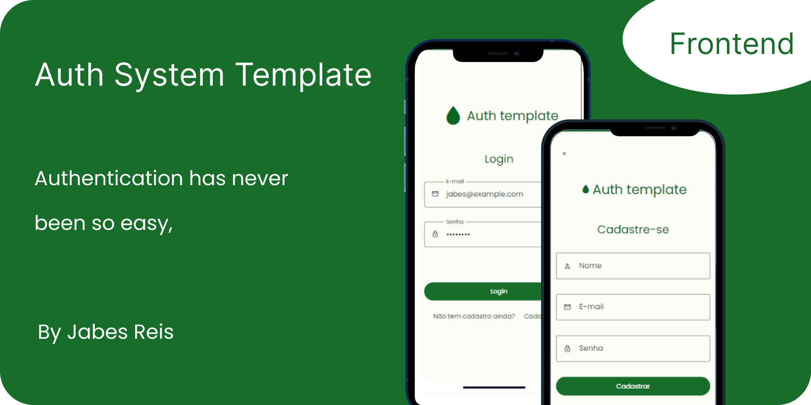
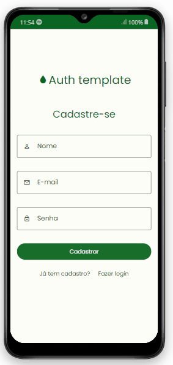
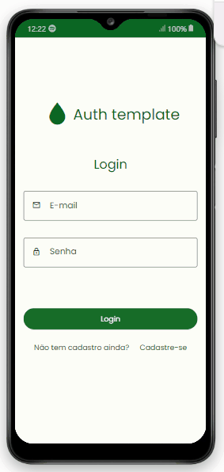
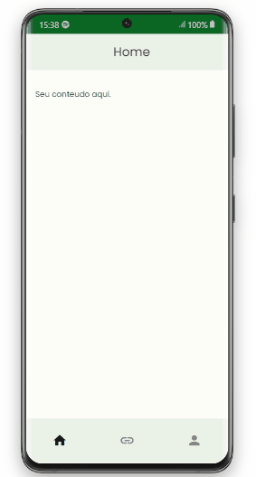
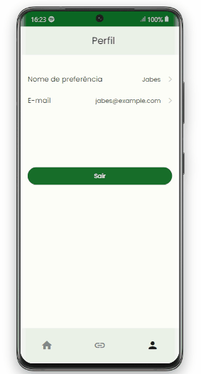
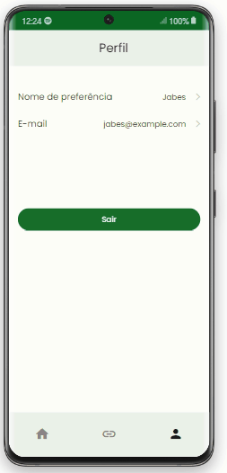
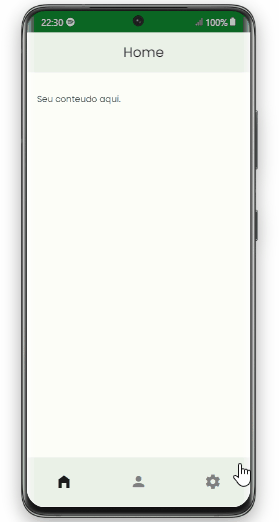
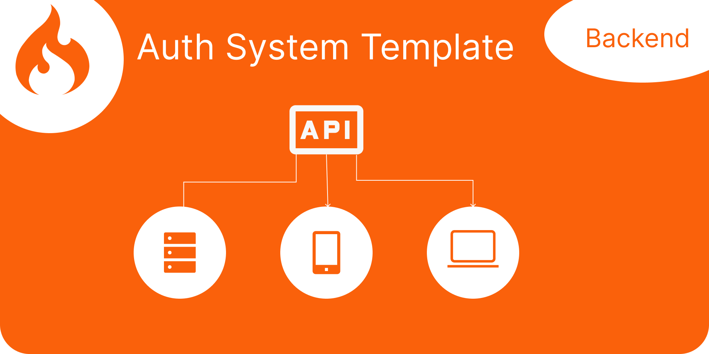

 # Auth Template - Auth made easy

 </br>

 

 ## :bookmark_tabs:Summary

- [Introduction](#Introduction)

- [Features and some gif's ](#features-and-demo)

    - AUTH
      - [Register ](#register)
      - [Login ](#login)
      - [Profile ](#profile)
      - [Logout ](#logout)
      - [update email](#update-email)
      - [update username](#update-username)
    - UI
      - [dark theme](#dark-theme)

- [Technologies](#Technologies)
- [Installation](#Installation)
- [My opinion about this project](#opinion)
- [Related Projects](#updates)
- [To do](#to-do)

<div id="Introduction">
</br>

## :page_facing_up:Introduction
This project is an  front end template for authentication which is integrated to an [API built in codeIgniter 4](https://github.com/Jabes-Enock/auth-template-api-codeIgniter)  to allow user to perform the basic actions of an authentication system.


For HTTP request we are using [AXIOS](https://axios-http.com/ptbr/docs/intro) and there is a file where you can define the ````baseURL````.

````
//www/js/config.js
const axiosInstance = axios.create({
  baseURL: 'http://your-url/api',
  headers: {
    "Content-Type": "application/json",
    "X-Requested-With": "XMLHttpRequest"
  }
})
````

</div>

<div id="features-and-demo">

## :checkered_flag: Features
Here you will see the main resources used in this project, as well as some Gif's.

### Register

<center>

</center>

<h4>Information</h4>

| Property  |  Description
|--- |--- 
| Endpoint | /auth/register
| Method | POST
| JSON body | username  \| email \| password

<br>

<h4>Valid data</h4>

This rules is set in the backend.

| Property  |  rules
|--- |--- 
| username | required \| unique
| email | required \| valid_email \| unique
| password | required  \| min_length[5] \| max_length[15]

<p>Code example:</p>

````
//www/js/auth/register.js
const response = await axiosInstance.post('/auth/register', {
  username: data.username,
  email: data.email,
  password: data.password,
})
````

<br>
<p>Successfully response:</p>


<br>
<p>Some  example errors messages:</p>


``In this case I have tried to register the user above again.``


````
{
  "username": "The username field must contain a unique value.",
  "email": "The email field must contain a unique value."
}
````

<br><br>

### Login

<center>

</center>

<h4>Information</h4>

| Property  |  Description
|--- |--- 
| Endpoint | /auth/login
| Method | POST
| JSON body | email \| password

<br>

<h4>Valid data</h4>

This rules is set in the backend.

| Property  |  rules
|--- |--- 
| email | required \| valid_email 
| password | required 

<p>Code example:</p>

````
//www/js/auth/login.js
const response = await axiosInstance.post('/auth/login', {
  email: data.email,
  password: data.password,
})
````

<br>
<p>Successfully response.</p>


```You will received a token.```

````
{
  "token": "585636b94277b58dd5b8912e4816c0dd23be735d0726759f86a684f60dfd74b2"
}
````

<br>
<p>Some  example errors messages:</p>


``Sending invalid credentials.``


````
{
  "message": "user not found"
}
````
<br/><br/>

### Profile

<center>

</center>

<h4>Information</h4>

| Property  |  Description
|--- |--- 
| Endpoint | /auth/profile
| Method | GET
| Header | Authorization 

<br>

<h4>Valid header</h4>

<p>Code example:</p>

````
//www/js/auth/profile.js
const response = await axiosInstance.get('/auth/profile', {
    headers: {
      'Authorization' : `Bearer ${token}`
    }
})
````

<br>
<p>Successfully response.</p>


```You will received the user data.```

````
{
    "id": 13,
    "username": "jabes",
    "email": "jabes@example.com"
}
````

<br>
<p>Some  example errors messages:</p>


``Sending an invalid token.``

````
{
  "status": 401,
  "error": 401,
  "messages": {
    "error": "Unauthorized"
  }
}
````
<br/><br/>

### Logout

<center>

</center>

<h4>Information</h4>

| Property  |  Description
|--- |--- 
| Endpoint | /auth/logout
| Method | GET
| Header | Authorization 

<br>

<h4>Valid header</h4>

<p>Code example:</p>

````
//www/js/auth/profile.js
const response = await axiosInstance.get('/auth/logout', {
    headers: {
      'Authorization' : `Bearer ${token}`
    }
})
````

<br>
<p>Successfully response.</p>


<br>
<p>Some  example errors messages:</p>

``Sending an invalid token.``


````
{
  "status": 401,
  "error": 401,
  "messages": {
    "error": "Unauthorized"
  }
}
````
<br/><br/>

</div>

<div id="update-email">

### Update email

<center>

</center>

<h4>Information</h4>

| Property  |  Description
|--- |--- 
| Endpoint | /auth/set-email/:user_id
| Method | POST
| Header | Authorization 
| JSON body | email \| confirm_email

<br>

<h4>Valid data</h4>

This rules is set in the backend.

| Property  |  rules
|--- |--- 
| email | required \| valid_email 
| confirm_email | required \| valid_email \| matches[email] 

<p>Code example:</p>

````
//www/js/auth/setEmail.js
 const response = await axiosInstance.post(`/auth/set-email/${id}`, 
        {
          email: data.email,
          confirm_email: data.confirm_email,
        },
        {
          headers: {
            'Authorization' : `Bearer ${token}`
          },
        }
      )
````

<br>
<p>Successfully response.</p>


<br>
<p>Some  example errors messages:</p>

``Payload``

````
{
	"email": "",
	"confirm_email": "newjabes@example.com"
}
````


````
{
	"email": "The email field is required.",
	"confirm_email": "The confirm_email field does not match the email field."
}
````

</div>
<div id="update-username">
<br/><br/>

### Update Username

<center>

</center>

<h4>Information</h4>

| Property  |  Description
|--- |--- 
| Endpoint | /auth/set-username/:user_id
| Method | POST
| Header | Authorization 
| JSON body | username \| confirm_username

<br>

<h4>Valid data</h4>

This rules is set in the backend.

| Property  |  rules
|--- |--- 
| username | required \| unique \| max_length[30] \| min_length[3]
| confirm_username | required  \| matches[username] 

<p>Code example:</p>

````
//www/js/auth/setUsername.js
 const response = await axiosInstance.post(`/auth/set-username/${id}`, 
        {
          username: data.username,
          confirm_username: data.confirm_username,
        },
        {
          headers: {
            'Authorization' : `Bearer ${token}`
          },
        }
      )
````

<br>
<p>Successfully response.</p>


<br>
<p>Some  example errors messages:</p>

``Payload``

````
{
	"username": "jabes enock",
	"confirm_username": "Jabes enock"
}
````


````
{
	"username": "The username field must contain a unique value.",
	"confirm_username": "The confirm_username field does not match the username field."
}
````
<br/><br/>

</div>

<div id="dark-theme">
<br/><br/>

### Dark theme

<center>

</center>

<br/><br/>

</div>

<div id="Technologies">

## :bar_chart: Technologies

##### :one: Framework7
[Framework7](https://framework7.io/docs/) - "is a free and open source framework to develop mobile, desktop or web apps with native look and feel. It is also an indispensable prototyping tool to show working app prototype as soon as possible in case you need to."
</br>

##### :two:  Axios
[Axios](https://axios-http.com/) - "Axios is a simple promise based HTTP client for the browser and node.js. Axios provides a simple to use library in a small package with a very extensible interface."
</br>

##### :three:  jQuery
[jQuery](https://jquery.com/) - "jQuery is a fast, small, and feature-rich JavaScript library. It makes things like HTML document traversal and manipulation, event handling, animation..."

##### :four:  Material design icons
[Material design icons | Pictogrammers](https://pictogrammers.com/library/mdi/) - "Open-source iconography for designers and developers"

</br>

</div>


<div id="Installation">

## :computer: Installation

#### Step 1 - Download this project

  ##### Option :one: - Download Zip 
  ##### Option :two: - Cloning a repository - [how to do this](https://docs.github.com/en/repositories/creating-and-managing-repositories/cloning-a-repository). 

</div>

</br>
<div id="opinion">

## :trophy: Testimony :trophy:
This project helped me understand how an authentication system is handle in the frontend and how I should send data to the API which have protect routes.

I created this project to use as a standard for applications developed in framework7, but feel free to adapt this project to create web applications developed in React, Vue or other technologies. Use creativity.
</div>
</br>


<div id="updates">

## :newspaper: See other related projects  :newspaper:

This project is related to An API built in codeIgniter 4, you can see the [API here](https://github.com/Jabes-Enock/auth-template-api-codeIgniter).



</div>

</br></br>

<div id="to-do">

## :white_check_mark: To do 
- :black_square_button: update user info like:
    - password

- :black_square_button: delete user
</div>
</br>

Made with :heart: by Jabes Enock